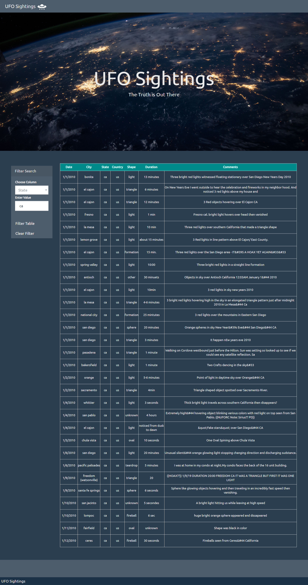

## Repository Contents

- [`index.html`](index.html) Webpage index displaying UFO sighting data
- [`app.js`](static/js/app.js) File to filter table data and create interactive buttons
- [`data.js`](static/js/data.js) File containing UFO sighting data
- [`style.css`](static/css/style.css) CSS file to format webpage

## Webpage Display

